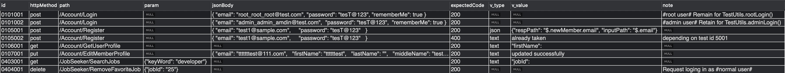

# Read Me
ApiArtist is an API automation framework that simplifies the process of writing tests. 
It provides easy way of writing and maintaining test case and data in database.

---
## Data model
All table and column names are recommended to be the same as shown in the following. 
Or you need to modify the corresponding SQL statements in the Environment and ApiArtist classes if 
you prefer other names.

####Environment settings
Environment settings are defined by two tables - 'EnvironmentSettings' and 'DBSettings'.
They are recommended to be stored with 'TestCases' where test data is, but this is not mandatory.
- EnvironmentSetting:

- DBSettings:


####Test cases
Each test case is defined by one row of in the test cases table. There can be multiple tables that
 stores test cases. Table names can be specified in SQL statements test code.

- 'param' - input parameters of an API request. It needs to be written in a json format. 'param' can
be left as 'null' if there is no parameter needed.
    ```
    {
      "key1":"value1",
      "key2":"value2"
    }
    ```
- 'jsonBody' - Input body of an API request.
- v_type - Verification type, which specifies the way of asserting API response.
- v_value - Verification value that specifies the expected value of verification.
#### Verification type & Verification value examples
- When you need to assert that the API response body contains certain text.

    | v_type  |  v_value | 
    |---|---|
    | text | this email address is already taken |

- When you need to assert that the responded json body contains the same value as 
in the API request json body, specify 'v_type' as 'json' and write the json paths of each value in 'v_value'.
For example, request json body is

    ```
    {
        "user":
                {
                    "username":"Alex"
                }       
    }
    ```
  
    You also know responded json body is supposed to be structured as

    ```
    {
        "newUsername": "responded name"
    }
    ```
    You want to assert that 'responded name' equals 'Alex', then
    
    | v_type | v_value |
    |---|---|
    |json| {"respPath": "$.newUsername", "inputPath": "$.user.username"}|
    

---


## How to write tests
- #### Set up test environment
    1. Define an EnvironmentEntrance instance, which specifies the database where 
    environment settings is stored.
        ```        
        EnvSettingEntrance entr = new EnvSettingEntrance(
                           "ip",
                           "port",
                           "databaseName",
                           "userName",
                           "password");
        ```
    2. Retrieve environment settings from 'EnvironmentSetting' to set test environment
        ```
        protected static Environment env;
        env = new Environment(entr, "EnvironmentSetting_id", "local test data, remote backend");
        ```
        In the above example, note parameter "local test data, remote backend" can be omitted.

- #### Write test
    1. User DataProvider to retrieve test data from database.
        ```
           @DataProvider(name = "Test Cases")
           private Object[] getTestCases() throws SQLException {
               String sql = "SELECT * FROM TestCases Where path LIKE '%/JobSeeker%';";
               return AAUtils.readDB(env.testDB, sql).toArray();
           }
       ```
        Note that 'env' is the Environment instance defined in the above step which contains a field 'testDB'.
        
    2. Test
        ```
       @Test(dataProvider = "Test Cases", groups = "requests logging in")
           public void testJobSeeker(Map<String, String> testCase) throws ParseException {
               ApiTest test = new ApiTest(env, testCase, token);
       
               switch (testCase.get("path")) {
                   case "/JobSeeker/AddFavoriteJob":
                       //Write code here to insert requested data in back end database
                       break;
                   case "/JobSeeker/ListFavoriteJobs":
                       //Write code here to insert favorite job id to favorite job list in back end database

                   default:
                       break;
               }
       
               assertThat(ApiArtist.execute(test).executionStatus, is(ExecutionStatus.Passed));
           }
       ``` 
### Built with
- REST Assured
- TestNG
- JDBC